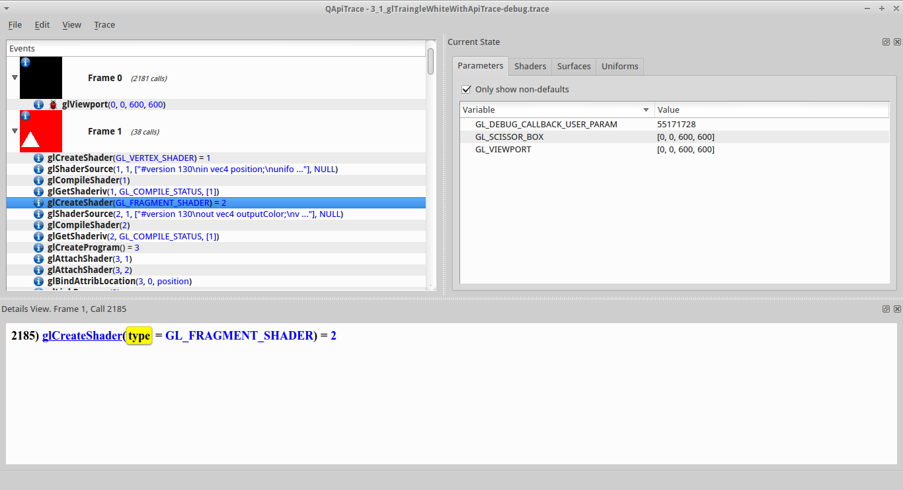

#Apitrace - Fragment Shader creation

##glCreateShader (fragment)

- [main.cpp line 158 in our C++ code](https://github.com/shearer12345/graphics_examples_in_git_branches/blob/glTraingleWhiteWithApiTrace/main.cpp#L158)
```C++
GLuint shader = glCreateShader(eShaderType);
```

- [glCreateShader](https://www.opengl.org/sdk/docs/man4/html/glCreateShader.xhtml) Creates a shader object
- in this case a fragment shader
- returns a non-zero value by which it can be referenced


20:24.png)

##glCreateShader (fragment) - context

- a new (empty) shader with ID=2 now exists in our context
- the shader is empty
- nothing else has changed

TODO - diagram of context, with a new fragment shader, based on 

##glShaderSource (fragment)

- [main.cpp line 160 in our C++ code](https://github.com/shearer12345/graphics_examples_in_git_branches/blob/glTraingleWhiteWithApiTrace/main.cpp#L160)
```C++
glShaderSource(shader, 1, &strFileData, NULL);
```

- [glShaderSource](https://www.opengl.org/sdk/docs/man4/html/glShaderSource.xhtml) — Replaces the source code in a shader object


##glShaderSource (fragment) - context

- the shader with ID=2 is now loaded with source
- nothing else has changed

TODO - diagram of context, with the fragment shader loaded with the source

##glCompileShader (fragment)

- [main.cpp line 162 in our C++ code](https://github.com/shearer12345/graphics_examples_in_git_branches/blob/glTraingleWhiteWithApiTrace/main.cpp#L162)
```C++
glCompileShader(shader);
```

- [glCompileShader](https://www.opengl.org/sdk/docs/man4/html/glCompileShader.xhtml) — Compiles a shader object


##glCompileShader (fragment) - context

- the shader with ID=2 has now been compiled
- nothing else has changed

TODO - diagram of context, with the fragment shader loaded with the source, and compiled

##glGetShaderiv (fragment)

- [main.cpp line 165 in our C++ code](https://github.com/shearer12345/graphics_examples_in_git_branches/blob/glTraingleWhiteWithApiTrace/main.cpp#L165)
```C++
glGetShaderiv(shader, GL_COMPILE_STATUS, &status);
```

- [glGetShaderiv](https://www.opengl.org/sdk/docs/man4/html/glGetShader.xhtml) - returns a parameter from a shader object
- in this case the compile status, which is 1 (=ok)
- nothing has changed in the context, we just queried it
    - queries are **expensive** (relatively) operations


