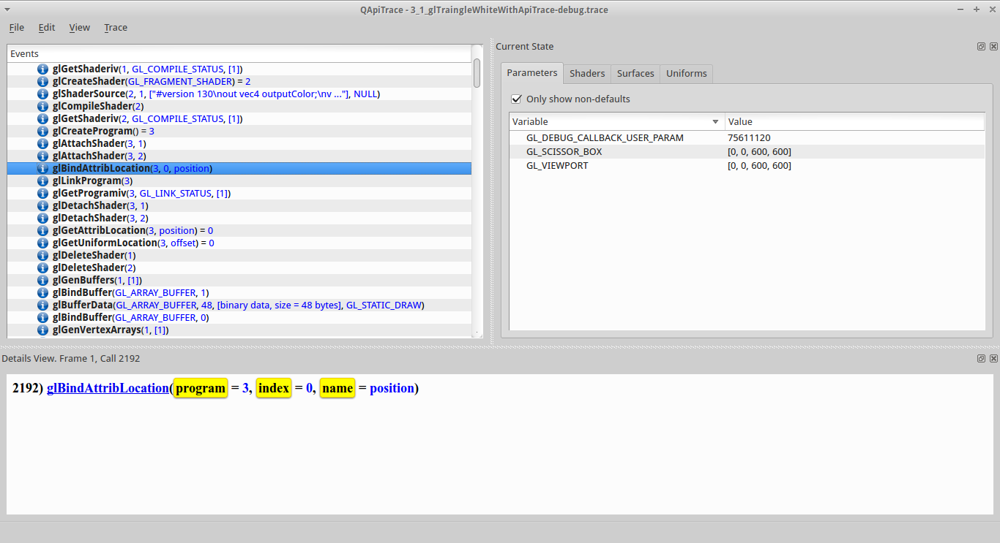

#Apitrace - GLSL program creation

##glCreateProgram

- [main.cpp line 191 in our C++ code](https://github.com/shearer12345/graphics_examples_in_git_branches/blob/glTraingleWhiteWithApiTrace/main.cpp#L191)
```C++
GLuint program = glCreateProgram();
```

- [glCreateProgram](https://www.opengl.org/sdk/docs/man4/html/glCreateProgram.xhtml) Creates a program object
- returns a non-zero value by which it can be referenced
- in this case the ID is **3**


##glCreateProgram - context

- a new GLSL program with ID=**3** now exists in our context
- the program is empty
- nothing else has changed

TODO - diagram of context, with a new GLSL program, based on 

##glAttachShader (vertex)

- [main.cpp line 194 in our C++ code](https://github.com/shearer12345/graphics_examples_in_git_branches/blob/glTraingleWhiteWithApiTrace/main.cpp#L194)
```C++
glAttachShader(program, shaderList[iLoop]);
```

- [glCreateProgram](https://www.opengl.org/sdk/docs/man4/html/glAttachShader.xhtml) Attaches a shader object to a program object
- in this case we are attaching to the program with ID=**3**, the shader with ID=**1 (our vertex shader)**


##glAttachShader (vertex) - context

- our GLSL program with ID=**3** now has our shader with ID=**1 (vertex)** attached
- the program is still empty
- nothing else has changed

TODO - diagram of context, based on 

##glAttachShader (fragment)

- [main.cpp line 194 in our C++ code](https://github.com/shearer12345/graphics_examples_in_git_branches/blob/glTraingleWhiteWithApiTrace/main.cpp#L194)
```C++
glAttachShader(program, shaderList[iLoop]);
```

- [glCreateProgram](https://www.opengl.org/sdk/docs/man4/html/glAttachShader.xhtml) Attaches a shader object to a program object
- in this case we are attaching to the program with ID=**3**, the shader with ID=**2 (our fragment shader)**


##glAttachShader (fragment) - context

- our GLSL program with ID=**3** now has our shader with ID=**2 (fragment)** attached
- the program is still empty
- nothing else has changed

TODO - diagram of context, based on 

##glBindAttribLocation

- this call doesn't actually exist in our program - it's been inserted by either SDL or a higher-level part of OpenGL
- **but**, we could have called it ourselves, if we wanted to choose the AttribLocation

- [glBindAttribLocation](https://www.opengl.org/sdk/docs/man4/html/glBindAttribLocation.xhtml) Associates a generic vertex attribute index with a named attribute variable
- in this case associates attribute index **0**, on our program with ID=3, with the GLSL name **position**



##glBindAttribLocation - context

- our GLSL program with ID=**3** now has **position** associated with attribute index **0**
- the program is still empty
- nothing else has changed

TODO - diagram of context, based on 

##glLinkProgram

- [main.cpp line 196 in our C++ code](https://github.com/shearer12345/graphics_examples_in_git_branches/blob/glTraingleWhiteWithApiTrace/main.cpp#L196)
```C++
glLinkProgram(program);
```

- [glLinkProgram](https://www.opengl.org/sdk/docs/man4/html/glBindAttribLocation.xhtml) Links a program object
- in this case out GLSL program with ID=**3**
- status of the link operation will be stored as part of the program object's state


##glLinkProgram - context

- our GLSL program now has a **linked program** in it, which we need to check the link status of
- nothing else has changed

TODO - diagram of context, based on 

##glGetProgramiv

- [main.cpp line 199 in our C++ code](https://github.com/shearer12345/graphics_examples_in_git_branches/blob/glTraingleWhiteWithApiTrace/main.cpp#L199)
```C++
glGetProgramiv(program, GL_LINK_STATUS, &status););
```

- [glGetProgramiv](https://www.opengl.org/sdk/docs/man4/html/glGetProgram.xhtml) Returns a parameter from a program object
- in this case get the GL_LINK_STATUS - if the linking worked


##glGetProgramiv - context

- no context change - this is a **get** function
- remember: **get** functions tend to be relatively expensive

##glDetachShader (vertex)

- [main.cpp line 212 in our C++ code](https://github.com/shearer12345/graphics_examples_in_git_branches/blob/glTraingleWhiteWithApiTrace/main.cpp#L212)
```C++
glDetachShader(program, shaderList[iLoop]);
```

- [glDetachShader](https://www.opengl.org/sdk/docs/man4/html/glDetachShader.xhtml) Detaches a shader object from a program object to which it is attached
- in this case we are detaching from the program with ID=**3**, the shader with ID=**1 (our vertex shader)**


##glDetachShader (vertex) - context

- our GLSL program with ID=**3** now has our shader with ID=**2 (fragment)** attached
- the program is still empty
- nothing else has changed

TODO - diagram of context, based on 

