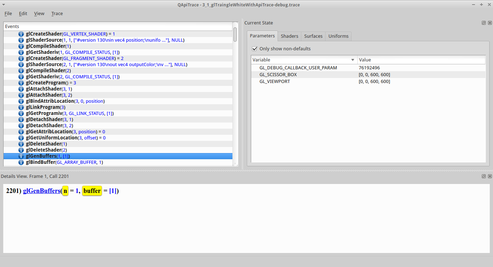

#Apitrace - Generate Buffers

##glGenBuffers

- [main.cpp line 243 in our C++ code](https://github.com/shearer12345/graphics_examples_in_git_branches/blob/glTraingleWhiteWithApiTrace/main.cpp#L243)
```C++
glGenBuffers(1, &positionBufferObject);
```

- [glGenBuffers](https://www.opengl.org/sdk/docs/man4/html/glGenBuffers.xhtml) generate buffer object names
- returns n buffer object names in buffers
- in this case only 1 name is asked for, and return, the ID of buffer object is **1**



##glGenBuffers - context

- new buffer objects (in this case just 1) are created
- the buffer object is empty
- the **ID/name** for the buffer object is stored in the address passed in
- nothing else has changed

TODO - diagram of context, based on 

