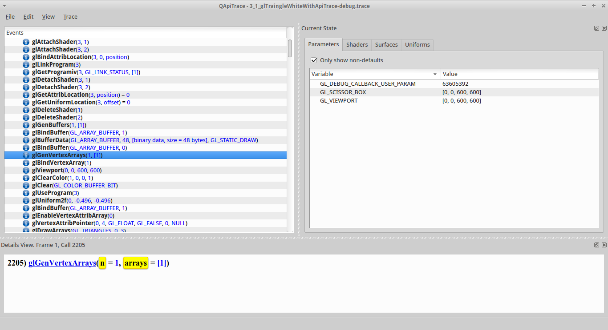

== Apitrace - Generate Vertex Arrays

=== glGenVertexArrays

* https://github.com/shearer12345/graphics_examples_in_git_branches/blob/glTraingleWhiteWithApiTrace/main.cpp#L257[main.cpp
line 257 in our C++ code]

[source,c++]

----
glGenVertexArrays(1, &vao); //create a Vertex Array Object
----

* https://www.opengl.org/sdk/docs/man4/html/glGenVertexArrays.xhtml[glGenVertexArrays]
generate vertex array object names
* returns *n* vertex array object names in *arrays*
* in this case only 1 name is asked for, and return, the ID of buffer
object is *1*
* a vertex array object *stores all of the state needed to supply vertex
data* to the pipeline
** see
https://www.opengl.org/wiki/Vertex_Specification#Vertex_Array_Object
** definitely worth reading - carefully

=== glGenVertexArrays - context

* new vertex array object (in this case just 1) are created
* technicaly, the vertex array object is empty
* it acquires state and type only when they first bound
* the *ID/name* for the vertex array object is stored in the address
passed in
* we will store state on the vertex array object later
* nothing else has changed

TODO - diagram of context, based on

=== glBindVertexArray

* https://github.com/shearer12345/graphics_examples_in_git_branches/blob/glTraingleWhiteWithApiTrace/main.cpp#L245[main.cpp
line 245 in our C++ code]
[source,c++]
----
glBindVertexArray(vao); //make the VAO active
----
* https://www.opengl.org/sdk/docs/man4/html/glBindVertexArray.xhtml[glBindVertexArray]
binds the specified vertex array object
* in this case the vertex array object with ID=**1** (our vao) is bound
as the GL_VERTEX_ARRAY_BINDING
** you can see this change in the OpenGL state (parameters tab)

image::assets/apitrace/06_glGenVertexArrays/02_glBindVertexArray.png[02_glBindVertexArray.png]

==== glBindVertexArray - context

* the *GL_VERTEX_ARRAY_BINDING* is now set to *1*
* nothing else has changed

TODO - diagram of context, based on

