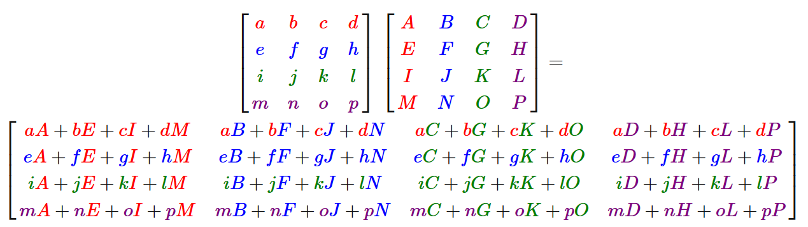
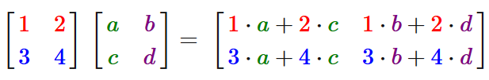
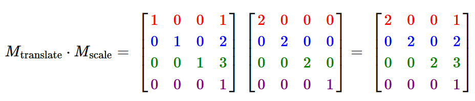
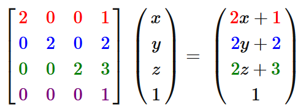

= Graphics - 08

== Transformations and 3D

== Where we are

* with the workshops and the lecture content you should now be beginning
to be comfortable with:
  ** the pipeline model of rendering
  ** how to setup OpenGL for rendering
  ** how to tell OpenGL how to use the data you've supplied it
  ** how to load data into OpenGL

== Where we are 2

  ** what shaders do
    *** specifically, the generic data each type of shader takes in and
passes out
  ** how to pass data into shaders
    *** as attributes, and uniforms
  ** how to move an object around using GLM and matrices

== Matrix-Matrix product - generic

* Transformation matrices can be applied to
vectors (through Matrix-Vector multiplication).
* By itself this seems like overkill
  ** It took far less effort to do a translation and scaling by hand than
with matrices

== Matrix-Matrix product - generic 2

* BUT, we want to apply these transformations to thousands or millions
of vertices
* so, we need things to be efficient and still flexible
* This is the real power of matrices
  ** we can combine *as many transformations as we want* into a single
matrix
  ** by multiplying the matrices together
* to allow the most complex transformations to any vertex with a simple
(matrix) multiplication

=== Matrix-Matrix product

* product, just means multiplication
* remember - we can only multiple matrices where the following are equal
* width of the first matrix
* height of the second matrix
* the *dot* just means multiply

== ready? ...

=== Matrix-Matrix product!! 4x4

=== Matrix-Vector product - 2x2

* the 4x4 is pretty overwhelming
* let's briefly look at a 2x2 to get a handle on this
* with some fixed numbers

=== Let's try

* we'll try to create a *single* matrix that
  ** scales a given vector by (2,2,2)
  ** then translates it by (1,2,3)
* NOTE: we want to scale the vector first, but the scale transformation
comes last in the multiplication.
* Pay attention to this when combining transformations or you'll get the
opposite of what you've asked for.
* To figure out the transformation from the vectors perspective, read
the transformation from the vector to the *LEFT!!*

=== Test it

* let's apply that to a test vector

== Matrix-Matrix product in practice

* both GLM (CPU-side) and GLSL (GPU-side) support Matrix-Matrix
multiplication
* GLM has a whole bunch of methods to support creating matrices for
specific cases, including:
  ** rotation
  ** translation
  ** scale
  ** setting up a viewpoint
  ** setting up a perspective view
* we're finally heading towards 3D

== 3D?

* in fact, *everything* we've been doing so far has *already* been in 3D
* we just were only creating triangles, and usually just with a constant
z-value
* to see 3D things we need to:
  ** use different z-values
  ** usually create solid-looking objects
    *** out of collections of triangles
  ** usually create some kind of perspective view so that objects
(triangles) further away appear smaller

== *Model* transformation

* this control of the position, orientation and scale of an object is
called the *Model* transformation
* we generically call the matrix to represent this the:
  ** *ModelMatrix*
  ** it's job is to represent the position, orientation and scale of an
object
  ** but not anything about the viewpoint, or the projection
  ** there are other matrices we use for that
  ** *separation of concerns*

== Why do the 4x4 Matrix multiplication CPU-side (with GLM)?

AKA - why calculate the matrices CPU-side?

* isn't that less efficient?
* YES
* but usually we need to know the effect of the transformations CPU-side
  ** (for collision detection, for example)
  ** it means we pass less into GLSL
  ** we can change to calculations we do CPU-side more easily than
GPU-side

== Why do the 4x4 Matrix multiplication CPU-side (with GLM)? 2

  ** if we want now to combine 3 matrices that's easy in C++,
  ** to do it GPU-side, we'd need to change
    *** the C++
    *** the uniforms of the GLSL
    *** the main of the GLSL

=== Why doing the 4x4 Matrix multiplication CPU-side (with GLM)?

* Except for the most common (frequency) 4x4 matrix multiplications
* *projectionMatrix * viewMatrix * modelMatrix*

== Moving to 3D

* to see 3D things we need to:
  ** use different z-values
  ** usually create solid-looking objects
    *** out of collections of triangles
  ** usually create some kind of perspective view so that objects
(triangles) further away appear smaller

== Depth Testing

...

== Blending

...

== Back-face Culling

...
