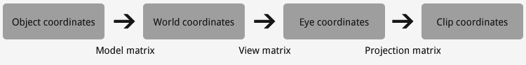
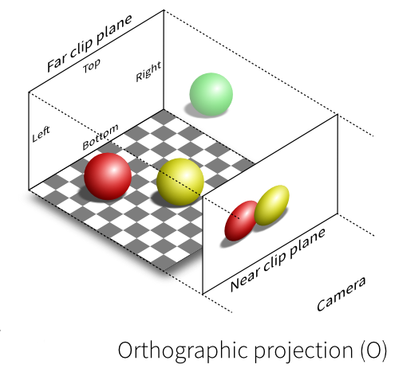
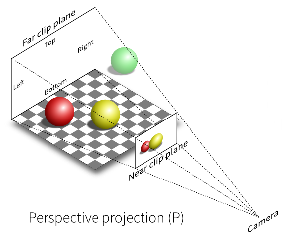
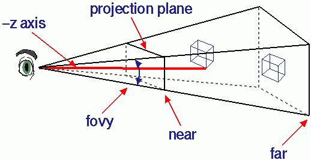

= Graphics - 09
include::links.adoc[]

== View and Projection Matrices

== Where we are

* with the workshops and the lecture content you should now be beginning
to be comfortable with:
  ** the pipeline model of rendering
  ** how to setup OpenGL for rendering
  ** how to tell OpenGL how to use the data you've supplied it
  ** how to load data into OpenGL
  ** what shaders do
    *** specifically, the generic data each type of shader takes in and
passes out
  ** how to pass data into shaders
    *** as attributes, and uniforms
  ** how to move an object around using GLM and matrices
  ** how to combine GLM matrices for more complex transformations

== Why doing the 4x4 Matrix multiplication CPU-side (with GLM)?

* isn't that less efficient?
* YES
* but usually we need to know the effect of the transformations CPU-side
  ** (for collision detection, for example)
  ** it means we pass less into GLSL
  ** we can change to calculations we do CPU-side more easily than GPU-side
  ** we can use the *same* GLSL code with very different input
  ** if we want now to combine 3 matrices that's easy in cpp,
  ** to do it GPU-side, we'd need to change
    *** the cpp
    *** the uniforms of the GLSL
    *** the main of the GLSL

=== Why doing the 4x4 Matrix multiplication CPU-side (with GLM)?

* Except for the most common (frequency) 4x4 matrix multiplcations
* *projectionMatrix * viewMatrix * modelMatrix*
* because *almost all* 3D scenes have these

NOTE: OpenGL allows you to decide on these steps yourself, all 3D graphics applications use a variation of the process described here - https://open.gl/transformations

== What does each matrix **do**?

* we pass these 3 matrices separately to GLSL because:
  ** A.  we use them for different purposes
    *** Model Matrix = position, orientation and scale of the model
    *** View Matrix = position and orientation of the camera
    *** Projection Matrix = how the camera goes from 3D to 2D
  ** B.  they change at different frequencies/rates

=== How often does each change?

* ???
* Model Matrix = position and orientation of the model
* View Matrix = position and orientation of the camera
* Projection Matrix = how the camera goes from 3D to 2D

=== How often does the Model Matrix change?

* Model Matrix = position and orientation of the model
  ** for every model (object) we render
  ** many times per frame

=== How often does the View Matrix change?

* View Matrix = position and orientation of the camera
  ** each time we change the viewpoint
  ** assuming a single render per frame (no HUD, no 2nd viewport)
  ** each time the camera moves
  ** ~= 1 per frame

=== How often does the Projection Matrix change?

* Projection Matrix = how the camera goes from 3D to 2D
  ** each time we change the projection
  ** assuming a single render per frame (no HUD, no 2nd viewport)
  ** rarely

== View Control

* OpenGL doesn't really have a concept of a camera
* In fact, the view is **ALWAYS**:
  ** from the origin (0,0,0)
  ** looking down the negative z-axis
* How do create a view that we want?

=== Creating the view we want

* move the whole world instead!!
* with the inverse transformation that we want applied to the "camera"!!
* e.g. to simulate the camera moving left, move *everything* in the
world to right
  ** before they are rendered
  ** i.e. in the vertex shader

== Compared to "old-style" OpenGL

* in "old-style" OpenGL (i.e. prior to OpenGL 3.0)
* you *only* had a *projection* matrix and a combined *modelview* matrix
* having a *view matrix* separately has obvious advantages
  ** we want to be able to control them separately

== How to set View Matrix in cpp/GLSL

* do it by hand
* just pass an array of 16-floats into OpenGL as a uniformMat4
  ** and use it in GLSL
* OR, use GLM
* just the same as controlling the transformations applied to models
  ** control the transformation applied to all models after the
modelMatrix has been applied
  ** ???
* Remember the viewMatrix has to transform the world with the *inverse*
of the transform you want applied to the "camera"

=== How to set View Matrix in cpp/GLSL

* Examples:
  ** `glmViewMatrixTranslate`
  ** `glmViewMatrixTranslateWithTwoCubes`
  ** `glmLookAt`

== Projection

* how the camera goes from 3D to 2D
* *Orthographic* projection
* or *Perspective* projection
* before projection our vertices are in *Camera Space*

=== Orthographic Projection diagram

* things further away are the same size as if they are near
* frustum is *always a cuboid*

=== Orthographic Projection

* `glm::ortho(-1, 1, -1, 1, -1, 1);`
  ** the default we've already been using
  ** is the *identity* matrix
* `glm::ortho(left, right, bottom, top, near, far);`
* also called *Orthogonal* projection

=== Orthographic Projection example

* `glmProjectionOrtho`

=== Perspective Projection

* a vertex at (0,0,?) should be rendered at the centre of the viewport
* *BUT* the distance to the camera in *z* also matters
* with two vertices with the same x and y coordinates
  ** but one with a larger z-value
  ** the larger z-valued vertex with be nearer the centre of the viewport
* this is *perspective projection*

=== Perspective Projection diagram

* frustum is a rectangular based pyramid with the point chopped off

=== Perspective Projection VS Orthographic Projection

image::assets/projectionPerspectiveVSOrthographic.png[http://www.labri.fr/perso/nrougier/teaching/opengl/images/ViewFrustum.png]

=== Representing Perspective Projection

* A 4x4 Matrix can represent this projection
* Easy to create with GLM

[source,cpp]
----
glm::mat4 projectionMatrix = glm::perspective(
fovy         // The Field of View in y (vertically)
4.0f / 3.0f, // Aspect Ratio. Depends on the size of your window/viewport.
0.1f,        // Near clipping plane. Keep as big **as possible**, or you'll get precision issues.
100.0f       // Far clipping plane. Keep as http://i.stack.imgur.com/XLpXa.gif.
);
----

=== Representing Perspective Projection

* A 4x4 Matrix can represent this projection
* Easy to create with GLM

=== Perspective Projection Perspective Non-Deformed

image::assets/projectionPerspectiveNonDeformed.png[http://www.opengl-tutorial.org/beginners-tutorials/tutorial-3-matrices/#The_Projection_matrix]

=== Perspective Projection Deformed

image::assets/projectionPerspectiveDeformed.png[http://www.opengl-tutorial.org/beginners-tutorials/tutorial-3-matrices/#The_Projection_matrix]

=== View From Behind Frustum

image::assets/ProjectionPerspectiveBehindFrustum.png[http://www.opengl-tutorial.org/beginners-tutorials/tutorial-3-matrices/#The_Projection_matrix]

=== View From Behind Frustum In Screen Coordinates

image::assets/projectionPerspectiveBehindFrustumInScreenCoordinates.png[http://www.opengl-tutorial.org/beginners-tutorials/tutorial-3-matrices/#The_Projection_matrix]

=== Perspective Projection example

* `glmProjection`
