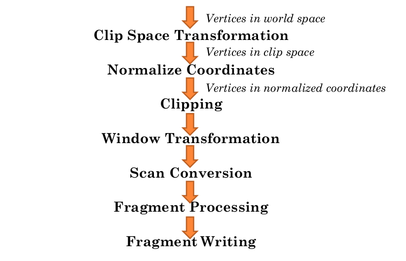
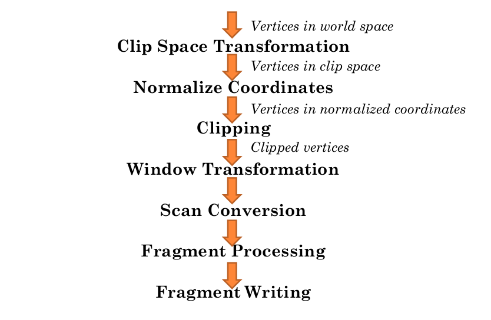

#Pipeline Overview

##Putting the **"Fun"** in Fundamentals

#
##Vertices in World Space

The pipeline is fed (*somehow, we'll cover later*) with **vertices** in **WORLD SPACE** (or **Object Space**)

\ 

#
##Clip Space Transformation

- Transform the vertices into a certain region of space
    - in OpenGL this is called **clip space**
- Also known as **projection transformation**
    - [http://arcsynthesis.org/gltut/Basics/Intro%20Graphics%20and%20Rendering.html](http://arcsynthesis.org/gltut/Basics/Intro%20Graphics%20and%20Rendering.html)
    - you get to **program** this bit (GLSL - vertex shader)

\ 

#
##Homogeneous Coordinates!!

- X,Y,Z and W!!!
    - W defines what the extents of clip space are for this vertex (-W to W on X, Y, Z)
- The process of transforming vertices into clip space is arbitrary (stupid)
    - OpenGL provides a lot of flexibility in this step
    - i.e. **programmable** flexibility!
- We'll cover homogeneous coordinates more later
    - http://www.tomdalling.com/blog/modern-opengl/explaining-homogenous-coordinates-and-projective-geometry/
    - http://www.songho.ca/math/homogeneous/homogeneous.html

#
##Vertices in Clip Space

\ 

#
##Normalized Device Coordinates

- Clip space is interesting, but inconvenient
    - the extent of this space is different for each vertex, which makes visualizing a triangle rather difficult
- The X, Y, and Z of each vertex's position is divided by W to get normalized device coordinates
    - basically the same as clip space except that the range of X, Y and Z are **[-1, 1]**

#
##Vertices in Normalized Device Coordinates

\ 

#
##Clipping

- Triangles not **fully** in **clip space** (the [-1,1] cube) we want to **clip**

\ 

#
##Clipping 2

- Points are easy to test in our new, normalised coordinate space (NDC)
- Lines are more difficult
- Triangles are complicated
    - may need to make more triangles

#
##Vertices in Clipped NDC

\ 

#
##Window Transformation

- Transform from normalized device coordinates towindow coordinates
   - window coordinates are relative to the window that OpenGL is running within
- Though they refer to the window, they are still three dimensional coordinates
    - still floating-point values
    - still have a z-coordinates!! Why?? Stay-tuned ...
    - bottom-left position is the origin (0, 0)

#
##Vertices in Window Coordinates

\ 

#
##Scan Conversion

- After conversion to window coordinates the triangle undergoes a process called **scan conversion**
    - also known as **rasterization**
- Takes the triangle and generates fragments that cover the area of the triangle
    - also fills in pixels for lines
- We'll look later at how scan conversion can be done

#
##Scan Conversion (triangles again)

- Image in the centre shows the digital grid of output pixels
    - the circles represent the centre of each pixel, the centre of each pixel represents a **sample**:
        - a discrete location within the area of a pixel

\ 

#
##Scan Conversion (more triangles)

- During scan conversion, a triangle will produce a **fragment** for every pixel sample that is within the 2D area of the triangle (right)
    - a rough **approximation** of the triangle's general shape

\ 

#
##Scan Conversion
###Shared Edges and ***the invariance guarantee*** (By Tom Clancy)

- triangles that share edges are very often rendered (unless you’re making asteroids)
- OpenGL offers the invariance guarantee
    - so long as shared edge vertex positions are **identical**, there will be no sample gaps during scan conversion
- What would happen otherwise??

\ 

#
##Scan Conversion (Still??)

- Scan conversion only uses X and Y position of the triangle in window coordinates to determine which fragments to generate
    -  the Z value is not forgotten!
- The result of scan converting a triangle is a sequence of fragments that cover the shape of the triangle
    - each fragment has data associated with it
        - the 2D location of the fragment in window coordinates
        - the Z position of the fragment
        - (a.k.a. known as the depth of the fragment)
        - there may be other information that is part of a fragment

#
##Fragments

\ 

#
##Fragment Processing

- Fragment processing takes a fragment from scan converted triangle and **transforms** it into
   - one or more colour values
   - a single depth value (z value)
   - you get to **program** this bit (GLSL - fragment shader)
- The order that fragments from a single triangle are processed in is irrelevant
    - *unlike* the order that triangles are pumped into the pipeline, a single triangle lies in a **single plane** so fragments generated from it **cannot overlap**
- **However**, the fragments from another triangle might
- ***Therefore, fragments from one triangle must all be processed before fragments from another triangle***

#
##Processed Fragments

\ 

#
##Fragment Writing (maybe)

- After generating one or more colours and a depth value
    - the fragment is **possibly** written to the destination (probably a frame buffer)
    - **What might control this?**
- This step involves more than simply writing to the destination image
    - These will be covered more later

#
##Colours

-  The usual description of a colour is as a series of numbers on the range **[0, 1] ***Why [0,1]?*
    - each of the numbers corresponds to the **intensity** of a particular reference colour
    - the final colour represented by the series of numbers is a mix of these reference colours
- The set of reference colours is called a **colour space**.
    - the most common colour space for screens is RGB, where the reference colours are Red, Green and Blue
    - printed works tend to use CMYK (Cyan, Magenta, Yellow, Black)]

\ 

#
##Colours 2

- Combining different intensities of this 3 colours, we can generate and display millions of different colour shades in OpenGL
    - how many colours? what is the usual representation?
        - [http://en.wikipedia.org/wiki/Color_depth#Deep_color_.2830.2F36.2F48-bit.29](http://en.wikipedia.org/wiki/Color_depth#Deep_color_.2830.2F36.2F48-bit.29)
    - in most conditions more than the human eye can perceive
        - any *special conditions?*
    - unless you're a tetrachromat ... [http://www.post-gazette.com/pg/06256/721190-114.stm](http://www.post-gazette.com/pg/06256/721190-114.stm)

#
##Shaders

- A shader is a program designed to be run on a renderer as part of the rendering operation
- Regardless of the kind of rendering system in use, shaders can only be executed at certain points in the rendering process
- These shader stages represent hooks where we can insert our code to create specific visual effects, for example:
    - transformation of an incoming vertex to clip space is a useful hook for user-defined code
    - the processing of a fragment into final colours and depth

#
##Shaders 2 (GLSL)

- Shaders for OpenGL are run on the actual rendering hardware so free up valuable CPU time for other tasks
    - and **usually** the graphics card has orders of magnitude more raw, though specialist processing power available
    - GeForce GTX 760 Ti - **2460 GFLOPS** single-precision!!
- Or perform operations that would be difficult if not impossible without the flexibility of executing arbitrary code
    - however, they live within certain limits that CPU code would not have to ...
    - ?? any guess what limits ??
- There are a number of shading languages available to various APIs. The one used here is the primary shading language of OpenGL, the **OpenGL Shading Language**, or **GLSL**. for short
    - It looks deceptively like C, **but it is very much not C**

#
##Shaders 3 (GLSL)

```GLSL
#version 330

layout(location = 0) in vec4 position;
uniform float loopDuration;
uniform float time;

void main()
{
	float timeScale = 3.14159f * 2.0f / loopDuration;
	
	float currTime = mod(time, loopDuration);
	vec4 totalOffset = vec4(
		cos(currTime * timeScale) * 0.5f,
		sin(currTime * timeScale) * 0.5f,
		0.0f,
		0.0f);

	gl_Position = position + totalOffset;
}
```